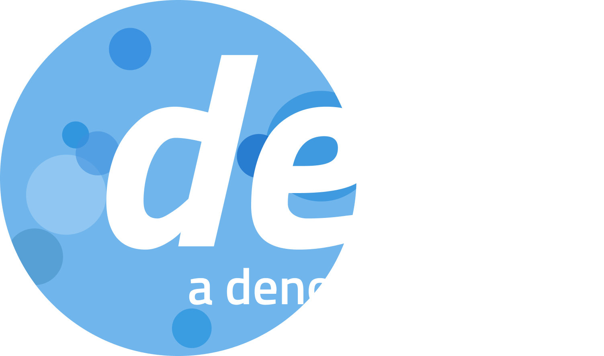

<p align="center">
  <a href="https://github.com/eserozvataf/dext">
    
  </a>
</p>


# Intro

✖️ **dext** is an ecosystem delivering practices, philosophy and portability 

dext consists of a set of **component**s that are designed to be used together. These sub-components enable developers to abstract their codes for better portability between platforms. Encourages ones to write codes once in functional approach, then run on mainstream environments such as cli, bot platforms, cloud-function runtimes and web apis.


# 🚀 Jumpstart

Ensure that [Deno](https://deno.land/) 1.27 or higher is installed on your system first.

**Alternative I**:

Install dext globally first, then create a new project:

```sh
$ deno install -A -f https://dext.deno.dev

$ dext create my-project

Creating "dext web template 0.0.1" on my-project...
...
done.
```


**Alternative II**:

Without any preparation, invoke creating a new project remotely:

```sh
$ deno run -A https://dext.deno.dev create my-project

Creating "dext web template 0.0.1" on my-project...
...
done.
```


# 📖 FAQ

## Want to report a bug or request a feature?

Please read through our [CONTRIBUTING.md](CONTRIBUTING.md) and report it using [GitHub Issues](https://github.com/eserozvataf/dext/issues)!

## Want to contribute?

It is publicly open for any contribution. Bugfixes, new features and extra components are welcome.

Check out issues with the `good first issue` and `help wanted` label if you are not sure how to begin. We suggest also looking at the closed ones to get a sense of the kinds of issues you can tackle.

Fork the repo, push your changes to your fork, and submit a pull request.

## Requirements

- Deno 1.27 or higher (https://deno.land/)

## License

Apache 2.0, for further details, please see [LICENSE](LICENSE) file.

## To Support

[Visit my GitHub Sponsors profile at github.com/sponsors/eserozvataf](https://github.com/sponsors/eserozvataf)
